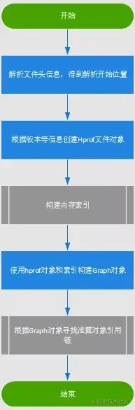

## 一、LeakCancary原理

### 1、LeakCanary如何触发检测?

第一步：在ActivityRefWatcher中注册Application.ActivityLifecycleCallbacks，监听activity的生命周期;

第二步：当触发onActivityDestroyed回调，生成弱引用对象KeyedWeakReference，将activity和key 放到KeyedWeakReference中，并与一个queue关联，当对象被回收时，该弱引用**对象将进入****queue**当中;

<!-- more -->


https://juejin.cn/post/6844904165265670157

### 2、检测可能泄漏的对象

**ReferenceQueue：**当一个object被GC掉之后，其相应的包装类，即KeyedWeakReference对象会被放入queue中，我们可以从queue中获取相应的对象信息，进行额外的处理；


第一次判断是否被回收，从ReferenceQueue队列中查询是否存在该弱引用对象，存在则说明已经被系统回收，直接return，不存在则说明未被回收；

如果没有被系统回收，则手动调用GC; 紧接着线程睡100毫秒，给系统回收的时间，随后通过System.runFinalization()手动调用已经失去引用对象的finalize方法。

第二次判断是否被回收，如果仍未被系统回收，则说明内存泄漏了；


```javascript
public final class RefWatcher {
  private final ReferenceQueue<Object> queue;  
  // 被怀疑内存泄漏的list集合，在最初watch时就把key add进来，
  // 后面会判断如果queue中的弱引用的key存在list中，则代表没有内存泄漏，直接remove
	private final Set<String> retainedKeys;

 
第二步：activity放到KeyedWeakReference中
public void watch(Object watchedReference, String referenceName) {
    //生成随机数，作为watchedReference的key，用于判断Reference中是否存在watchedReference，存在则代表已被回收
    String key = UUID.randomUUID().toString(); 
    retainedKeys.add(key);
    final KeyedWeakReference reference =new KeyedWeakReference(watchedReference, key, referenceName, queue);
    // watchedReference是被检测的Object对象，这里是activity

     //最终调用的方法
		ensureGone(refernce, ...)
}

           
           
第三步：判断是否内存泄漏
Retryable.Result ensureGone(KeyedWeakReference reference, ...){
    //第一次判断是否被系统回收
    removeWeaklyReachableReferences();
    if (gone(reference)) {
      return DONE;
    }
    
    // 未被系统回收，手动触发GC，然后sleep100ms
		gcTrigger.runGc();
      
    // 第二次判断是否被回收
		removeWeaklyReachableReferences();
		if (!gone(reference)) {
      //内存泄漏
      
		}
		return DONE;
  }

	// 通过判断retainedKeys集合中是否存在对应的key判断该对象是否被回收
  private boolean gone(KeyedWeakReference reference) {
    return !retainedKeys.contains(reference.key);
  }

  // queue中存在该弱引用，则代表该若引用的对应的对象已经被内存回收，可以根据key从去remove
  // 删除所有已被回收的对象的key，排除他们是内存泄漏的可能，retainedKeys中剩下的就是有嫌疑的对应；
  private void removeWeaklyReachableReferences() {
    // queue是一个ReferenceQueue<Object>队列;
    KeyedWeakReference ref;
    while ((ref = (KeyedWeakReference) queue.poll()) != null) {
      retainedKeys.remove(ref.key);
    }
  }


}
```

### 3、 LeakCanary触发堆快照，生成hprof文件

把堆栈信息保存在文件系统中的.hprof文件里；


moveToRetained之后会调用到HeapDumpTrigger.checkRetainedInstances方法
checkRetainedInstances() 方法是确定泄露的最后一个方法了。
这里会确认引用是否真的泄露，如果真的泄露，则发起 heap dump，分析 dump 文件，找到引用链；


### 4、如何分析hprof文件

   	分析hprof文件的工作主要是在HeapAnalyzerService类中完成的

HeapAnalyzerService被开启在一个独立的进程中，并且HeapAnalyzer使用了HAHA开源库解析了指定时刻的堆栈快照文件heap dump；


解析流程如下所示:


简要说下流程：
1.解析文件头信息，得到解析开始位置
2.根据头信息创建Hprof文件对象
3.构建内存索引
4.使用hprof对象和索引构建Graph对象
5.查找可能泄漏的对象与GCRoot间的引用链来判断是否存在泄漏(使用广度优先算法在Graph中查找)；


Leakcanary2.0较之前的版本最大变化是改由kotlin实现以及开源了自己实现的hprof解析的代码，总体的思路是根据hprof文件的二进制协议将文件的内容解析成一个图的数据结构，然后广度遍历这个图找到最短路径，路径的起始就是GCRoot对象，结束就是泄漏的对象

具体分析可见：[Android内存泄漏检测之LeakCanary2.0（Kotlin版）的实现原理](https://link.juejin.cn?target=https%3A%2F%2Fzhuanlan.zhihu.com%2Fp%2F360944586)


### 5、泄漏结果存储与通知

主要做了两件事
1.存储泄漏分析结果到数据库中
2.展示通知，提醒用户去查看内存泄漏情况

## 二、.为什么LeakCanary不能用于线上?


理解了LeakCanary判定对象泄漏后所做的工作后就不难知道，直接将LeakCanary应用于线上会有如下一些问题：

### 2.1、存在问题

1.每次内存泄漏以后，都会生成一个.hprof文件，然后解析，并将结果写入.hprof.result。增加手机负担，**引起手机卡顿**等问题。
2.多次调用GC，可能会对线上**性能产生影响**
3.同样的泄漏问题，会**重复生成 .hprof 文件**，重复分析并写入磁盘。
4.**.hprof文件较大**，信息回捞成问题。


### 2.2、解决方案

**了解了这些问题，我们可以尝试提出一些解决方案：**

1.可以根据手机信息来设定一个内存阈值 M ，当已使用内存小于 M 时，如果此时有内存泄漏，只将泄漏对象的信息放入内存当中保存，不生成.hprof文件。当已使用大于 M 时，生成.hprof文件
2.当引用链路相同时，可根据实际情况去重。
3.不直接回捞.hprof文件，可以选择回捞分析的结果
4.可以尝试将已泄漏对象存储在数据库中，一个用户同一个泄漏只检测一次，减少对用户的影响


## 三、新版本LeakCanary的变动

1、去除了 1.x release 环境下引用的空包 leakcanary-android-no-op

2、Kotlin 语言覆盖高达 99.8%

3、不需要在 Application 里面做 LeakCanary.install(this);，可以直接通过添加库依赖的方式注册； ContentProvider 的 onCreate() 的调用时机介于 Application 的 attachBaseContext() 和 onCreate() 之间；

（原因：https://juejin.cn/post/6844903861086486535）


参考文档：

https://juejin.cn/post/6968084138125590541#heading-13

https://juejin.cn/post/6844903762658590728#heading-20

https://juejin.cn/post/6844903730190483470#heading-9
